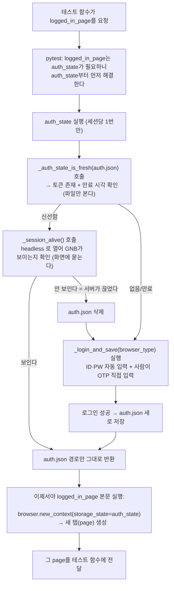

# 로그인 테스트 노트

`test_login.py`에 짠 두 테스트 — **로그인 실패**와 **로그인 성공(+세션 갱신)** — 가 각 줄에서 뭘 하는지, 그리고 왜 이렇게 짰는지 정리했습니다.

## 왜 실패 → 성공 순서인가

같은 파일 안에서 **위에 정의된 함수가 먼저 실행**되는 pytest 기본 동작을 그대로 이용했습니다. 두 순서를 이렇게 둔 이유는 기능적 의존성 때문이 아니라 **운영상 이유**입니다.

| | 계정 | 사람 개입 | 실행 시간 |
|---|---|---|---|
| **1. 로그인 실패** (TC-103) | testyoona (권한 없음) | 없음 — 완전 자동 | 수 초 |
| **2. 로그인 성공** (TC-114) | adminyoona (정상) | 필요 — 인증번호 직접 입력 | 사람이 반응할 때까지 대기 |

> **계정 두 개로 단순화**
>
> 원래는 권한별로 계정을 더 나누려 했는데(TC-134, 설치관리자 권한 케이스), 설치관리자 권한은 실제로 거의 안 쓰는 권한이라 지금 범위에서 뺐습니다. 지금은 **로그인 자체가 안 되는 계정(testyoona)**과 **정상 로그인 계정(adminyoona)** 둘로만 검증합니다.

> **그래서**
>
> 빠르고 완전 자동인 것부터 먼저 돌려서 **바로 결과를 확인**하고, 사람이 붙어있어야 하는 것(2번)은 뒤에 두는 게 자연스럽습니다. 순서를 바꿔도 테스트 자체는 깨지지 않습니다 — 둘은 서로 독립적입니다.

## 01. 로그인 실패 — 완전 자동

`test_TC103_login_fail_no_permission`

```python
def test_TC103_login_fail_no_permission(page):
    page.goto(STAFF_URL)
    page.get_by_placeholder("아이디").fill(NOAUTH_EMAIL)
    page.get_by_placeholder("비밀번호").fill(NOAUTH_PASSWORD)
    page.get_by_role("button", name="로그인").click()

    expect(page.get_by_text("권한이 없는 계정입니다")).to_be_visible()
```

- **`page.goto(STAFF_URL)`** — 로그인 화면으로 이동. `STAFF_URL`은 파일 위에서 `.env`의 `STAFF_URL`을 읽어옵니다.
- **`NOAUTH_EMAIL` / `NOAUTH_PASSWORD`** — 실제로 존재하는 계정(testyoona)입니다. 없는 계정이 아니라, 아이디·비밀번호는 맞는데 권한이 없어서 막히는 경우라 TC-102(존재 안 하는 계정)와는 다른 알럿 문구가 뜹니다.
- **`.click()`** — 로그인 버튼 클릭. `page` 기본 fixture라 **매 테스트마다 새 브라우저 컨텍스트**(로그인 안 된 깨끗한 상태)로 시작합니다.
- **`expect(...).to_be_visible()`** — THEN — "권한이 없는 계정입니다" 알럿이 뜨는지 확인. 이게 이 테스트의 **유일한 판정**입니다.

> **아직 손봐야 할 부분**
>
> `get_by_placeholder`, `get_by_text`의 문자열은 **추측으로 넣은 값**입니다. 실제 화면에서 Pick Locator로 정확한 값 확인 후 교체하세요.

## 02. 로그인 성공 — 반자동 (사람 개입 필요)

`test_TC114_login_success_and_refresh_session`

> **이건 "완전 자동화 테스트"가 아닙니다**
>
> 2단계 인증번호는 실제 문자로 오기 때문에 **코드가 알 수 없습니다.** 그래서 이 테스트는 아이디·비밀번호까지만 자동으로 하고, **그 다음은 사람이 뜬 브라우저 창에서 직접** 인증번호를 입력하고 [확인]을 누르는 구조입니다.

> **`conftest.py`의 `auth_state` fixture를 그대로 씁니다**
>
> 처음엔 `_login_and_save`를 직접 호출해서 **매번 무조건** 실제 로그인을 검증하게 짰습니다. 그런데 그렇게 하면 `pytest test_login.py`를 돌릴 때마다 `auth.json`이 이미 신선해도 매번 사람이 인증번호를 다시 쳐야 해서 번거로웠습니다. 그래서 이 테스트도 다른 테스트들과 똑같이 **`auth_state` fixture를 그대로 받아 쓰도록 바꿨습니다** — `auth.json`이 신선하면 로그인 자체를 건너뛰고, 없거나 만료됐을 때만 실제 로그인을 수행합니다.
>
> 이건 **의미가 살짝 바뀐 것**이기도 합니다 — 예전엔 "TC-114 = 로그인이 실제로 되는지 매번 검증"이었다면, 지금은 "TC-114 = 유효한 세션이 준비되어 있는지 확인(없으면 그때 만듦)"에 더 가깝습니다. 로그인 로직 자체가 정말 잘 동작하는지 다시 확실히 확인하고 싶으면, `auth.json`을 지우고 이 테스트를 돌리면 됩니다.

```python
def test_TC114_login_success_and_refresh_session(logged_in_page, auth_state):
    page = logged_in_page

    assert os.path.exists(auth_state)                                     # (1) 파일

    page.goto(STAFF_URL)
    expect(page.get_by_text("로그아웃", exact=True)).to_be_visible()         # (2) 인증된 화면
    expect(page.get_by_role("button", name="로그인")).not_to_be_visible()

    assert EXPECTED_ACCOUNT
    expect(page.locator(ACCOUNT_LABEL_SELECTOR)).to_have_text(EXPECTED_ACCOUNT)   # (3) 그 계정
```

- **`auth_state`** — `conftest.py`에 정의된 session-scope fixture. `auth.json`이 신선하면 로그인을 건너뛰고 경로만 돌려주고, 아니면 그 안에서 `_login_and_save`(로그인 전용 headed 브라우저 + 사람이 인증번호 직접 입력)를 실행한 뒤 경로를 돌려줍니다.
- **`logged_in_page`** — 그 세션으로 새 탭을 엽니다. `auth_state`에 의존하는 fixture라 둘을 같이 받아도 로그인이 두 번 일어나지 않습니다.
- 로그인이 실제로 실행되는 경우에만 `--headed` 없이도 자동으로 로그인 전용 브라우저가 뜹니다. `auth.json`이 이미 신선하면 브라우저 창이 아예 안 뜨고 바로 통과합니다.

### 2026-09-10 — (1)만 있던 것을 (2)(3)으로 보강

전에는 본문이 `assert os.path.exists(auth_state)` **한 줄**이었습니다. 제목은 "세션 저장·갱신
확인"인데 확인하는 건 *파일이 디스크에 있는가* 뿐이라, 아래가 전부 검증 없이 통과했습니다.

| 실제로 이래도 | 예전 TC-114는 |
|---|---|
| `auth.json` 안이 빈 껍데기(쿠키 0개)여도 | 통과 |
| 그 세션으로 화면에 들어가면 로그인 페이지로 튕겨도 | 통과 |
| 서버가 그 세션을 이미 무효화했어도 | 통과 |

세 번째는 **실제로 물렸던 상황**입니다 — 바로 아래 "왜 '파일이 신선한가' 만으로는 부족한가"
장의 그 사고입니다. 그날 `_session_alive()` 를 넣어 fixture 쪽은 막았지만, **TC-114 자신은
여전히 파일만 보고 있었습니다.** 세션이 죽은 걸 알아채는 장치가 사전조건에만 있고 정작
"세션을 검증한다"는 그 TC에는 없던 셈입니다.

**무엇을 신호로 쓸지는 실측으로 정했습니다** (2026-09-10, 프로브 스크립트). 같은 주소를 두
상태로 열어 비교했습니다.

| | 인증 상태 (auth.json) | 미인증 (빈 컨텍스트) |
|---|---|---|
| body 앞부분 | `IMAS / adminyoona / 고객관리 / … / 로그아웃` | `IMS CONNECT / 로그인 / 비밀번호 찾기` |
| `로그아웃` | 있음 (`label.menu-label`) | 없음 |
| 계정 표시 | `div.menu-userName` = `adminyoona` | 없음 |
| [로그인] 버튼 | 없음 | 있음 |

**밟은 함정 둘.**

처음 쓰려던 `get_by_role("link", name="차량관리")` 는 **count=0** 입니다. 이 화면의 GNB
링크는 accessible name이 안 잡혀서 role로는 하나도 안 걸립니다(`role=link` 로 잡히는 건
`IMAS` 하나뿐). `conftest.py` 의 `_session_alive` 와 `FieldServicePage.goto` 가
`locator("a").filter(has_text=...)` 를 쓰던 이유가 이것입니다.

헤더 계정 표시는 **이메일 전체가 아니라 `@` 앞부분**입니다. 아이디 필드에는 전체를 넣는데
헤더에는 `adminyoona` 만 찍힙니다. 그래서 `.env` 의 `STAFF_ADMIN_EMAIL` 에서 잘라 쓰고
하드코딩하지 않습니다 — 계정을 바꾸면 이 TC도 따라옵니다. (쿠키 `imas-staff-name` 은 한글
이름 `관리자유나` 라 헤더 표시와 다릅니다. 헤더 쪽이 아이디입니다.)

**긍정 검증을 부정 검증보다 먼저 둡니다.** `[로그인] 버튼이 없다`만 있으면 화면이 아직 안
그려졌을 때도 통과합니다. 앞의 `[로그아웃]이 보인다`가 렌더 완료를 보장하는 하한입니다.

**이 화면엔 `data-testid` 가 하나도 없어서** 계정 표시는 클래스로 잡고 `# TODO(testid):`
주석을 남겨 FE 요청 근거로 쌓아둡니다.

**빨간불이 되는지 직접 확인했습니다** — 빈 컨텍스트(=세션이 죽은 상황)에서 (2)(3)을 그대로
돌려보니 셋 다 실패했습니다. 통과하는 것만 보고 "검증이 된다"고 말하지 않기 위한 절차입니다.

### 왜 메인화면 확인을 특정 메뉴 대신 "로그인 버튼 사라짐"으로 했나

계정마다 보이는 메뉴 구성이 다를 수 있어서, 특정 메뉴 이름에 의존하는 대신 **어떤 계정으로 로그인하든 항상 참인 조건**인 "로그인 화면을 벗어났다(로그인 버튼이 사라졌다)"를 기준으로 잡았습니다. 계정 권한 구조가 아직 다 확정된 게 아니라서(설치관리자 권한처럼), 가장 안전하고 일반적인 조건으로 시작한 것입니다.

> **~~더 정확하게 하고 싶다면~~ → 2026-09-10 에 했습니다**
>
> 여기 적어둔 "상단 계정명을 찾아 `to_be_visible` 로 바꾸면 더 명확해진다" 가 바로 위
> (2)(3) 입니다. 다만 `_login_and_save` 안의 `to_be_hidden` 판정은 그대로 뒀습니다 —
> 그건 **로그인 진행 중**(2FA 창이 닫히기를 기다리는 자리)이라 아직 메인화면 요소가 없고,
> 계정별 메뉴 차이에 안 걸리는 지금 기준이 여전히 맞습니다. 바꾼 것은 **로그인이 끝난 뒤**
> 세션을 검증하는 TC-114 쪽입니다.

## 03. `logged_in_page`를 쓰는 모든 테스트의 실행 흐름

TC-114뿐 아니라, `logged_in_page`를 받는 **모든** 테스트(TC-043~050, TC-084~087 등)가 시작될 때 매번 이 순서를 거칩니다.



> **헷갈리기 쉬운 지점 — 실행 순서**
>
> `def logged_in_page(browser, auth_state):`처럼 fixture가 다른 fixture를 매개변수로 받으면, **그 매개변수(`auth_state`)가 먼저 완전히 실행되어 값을 반환한 뒤에야** `logged_in_page`의 본문이 실행됩니다. "`logged_in_page`가 실행되다가 중간에 `auth_state`를 호출하는" 게 아니라, **`auth_state`가 선행 조건으로 먼저 끝나 있어야 `logged_in_page` 본문이 시작될 수 있는** 구조입니다 — 본문 안의 `browser.new_context(storage_state=auth_state)`가 `auth_state`의 반환값(파일 경로)을 바로 써야 하기 때문입니다.

> **`logged_in_page`가 최종적으로 건네는 건 "로그인된 브라우저"가 아니라 "세션이 적용된 새 탭"**
>
> `browser`(브라우저 프로그램 자체)는 이미 떠 있는 공용 자원이고, `logged_in_page`가 매 테스트마다 새로 만드는 건 그 안의 **`context`(독립 세션) 하나와, 그 안의 `page`(탭) 하나**뿐입니다. `storage_state=auth_state`로 로그인 쿠키를 그 새 컨텍스트에 밀어 넣기 때문에 "로그인된 것처럼 보이는" 것이고, 실제로 로그인 절차(ID/PW 입력, OTP)를 다시 거치는 게 아닙니다.

### 왜 "파일이 신선한가" 만으로는 부족한가 (2026-09-10 실측)

`_auth_state_is_fresh` 는 **`auth.json` 파일에 적힌 만료 시각만** 봅니다. 그걸로 세션이
살아 있다고 판정하면 조용히 틀립니다 — 서버가 세션을 이미 끊었는지는 파일에 안 적혀 있습니다.

실제로 이렇게 물렸습니다.

| 시각 | 무슨 일 |
|---|---|
| 09-09 11:54 | 로그인 성공. 쿠키 만료가 **09-10 11:54** 로 저장됨 |
| 09-10 10:01 | `run_tests_and_report.bat` 실행. 만료까지 1시간 53분 남아 `_auth_state_is_fresh` 가 "신선함" 이라고 답함 |
| | 그래서 **재로그인이 일어나지 않음** — 2FA 창을 기다렸는데 안 뜸 |
| | 그런데 서버 쪽 세션은 이미 죽어 있었음(계정당 단일 세션) |
| 10:03 | 모든 TC 가 로그인 화면에서 GNB `차량관리` 를 30초씩 기다리다 타임아웃 → **전부 ERROR** |

증상이 '전부 실패' 라 코드 버그처럼 보이는데 원인은 세션입니다. 게다가 **고칠 방법이
사람에게 안 보였습니다** — 로그인 창을 띄우려면 `auth.json` 을 손으로 지워야 했고,
그걸 알아야 한다는 사실 자체가 어디에도 안 적혀 있었습니다.

그래서 `_session_alive()` 를 넣었습니다. 파일이 아니라 **화면에 물어봅니다** — headless 로
한 번 열어서 GNB 상위 메뉴가 보이는지 확인하고, 안 보이면 `auth.json` 을 지우고 로그인을
새로 합니다. 판정 기준을 GNB 로 잡은 이유는 **테스트가 실제로 의존하는 것과 같은 신호**라
새로 단정하는 게 없기 때문입니다(위 표의 타임아웃이 바로 그 신호가 없었다는 증거입니다).

비용은 세션당 headless 브라우저 1회(약 3~5초)이고, 막는 것은 20분짜리 전체 ERROR 실행입니다.

★ `_auth_state_is_fresh` 에는 구멍이 하나 더 있습니다 — 세션 쿠키(`expires == -1`)는
  만료 판정에서 제외하도록 짜여 있어서 **영원히 "신선함" 이라고 답합니다.** 지금 dev 쿠키는
  만료 시각이 있어서 안 밟았지만, 서버가 세션 쿠키로 바뀌면 그 즉시 밟습니다.
  `_session_alive` 가 뒤에 있으므로 무해해졌습니다 — 그게 이 검사를 화면 쪽에 둔 이유입니다.

## 돌리기 전에 확인할 것

1. **`.env`에 비밀번호 2개 채우기** — `STAFF_ADMIN_PASSWORD=`(adminyoona)와 `STAFF_NOAUTH_PASSWORD=`(testyoona) 뒤에 각 계정 비밀번호를 직접 입력하세요. 이 파일은 `.gitignore`에 있어 git에는 안 올라갑니다.
2. **TODO로 표시된 셀렉터 확인** — `get_by_placeholder`·`get_by_text`에 쓴 문자열이 추측값입니다. 실제 화면에서 Pick Locator로 정확한 값을 확인해서 바꾸세요.
3. **실행**
   ```bash
   pytest test_login.py -v
   ```
   `--headed`는 안 주셔도 됩니다 — 실제로 로그인이 필요할 때만 `auth_state`가 로그인 전용 브라우저를 코드로 직접 headed로 켭니다. `-s`도 이제 필요 없습니다(2026-09-10 부터): `auth_state`가 **로그인 구간에만** pytest 의 출력 가로채기를 껐다 켜므로 인증번호 안내 문구가 그냥 보입니다. 전체를 `-s`로 여는 것보다 나은 이유는 다른 TC 의 출력은 그대로 가둬둬서 리포트가 깨끗하기 때문입니다.
4. **TC-114 실행 중엔 상황에 따라 다릅니다** — `auth.json`이 이미 신선하면 브라우저 창 없이 바로 통과합니다. 만료됐거나 없으면 로그인 전용 브라우저가 새로 뜨고 터미널에 안내 메시지가 뜹니다. 그 창에서 **직접 인증번호를 입력하고 [확인]을 눌러주세요.** 그러면 자동으로 이어서 진행되고 `auth.json`이 갱신됩니다.

---
`test_login.py` · `conftest.py`의 `_login_and_save`, `auth_state`, `logged_in_page`와 이 파일의 흐름을 함께 참고하세요.
