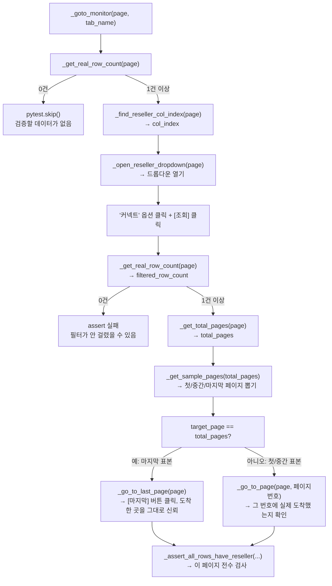

# 모니터 리셀러 필터 테스트 노트

`test_monitor_reseller_filter.py` — 단말기>모니터 화면의 **TC-084**(리셀러 필터 노출, 7개 탭)와 **TC-085**(리셀러 필터 선택 항목)를 다룹니다. 둘 다 셀렉터를 한 번에 못 맞추고 실제로 실행해보면서 고친 부분이 많아서, 그 과정까지 같이 적어둡니다.

## 공통 함수 한눈에 보기

이 파일의 모든 테스트(TC-084~087)는 아래 7개 함수를 조합해서 짜여 있습니다. 각 함수가 정확히 뭘 하는지는 이 표로, 언제 뭘 부르는지는 바로 아래 흐름도로 보시면 됩니다.

| 함수 | 하는 일 | 반환값 |
|---|---|---|
| `_goto_monitor(page, tab_name)` | 단말기>모니터 진입 + 탭 전환 + 로딩 대기 + 날짜 필터 있으면 오늘로 보정 | 없음 (부수효과만) |
| `_open_reseller_dropdown(page)` | "리셀러" 콤보박스를 찾아서 클릭해 엶 | 열린 드롭다운의 Locator |
| `_find_reseller_col_index(page)` | 지금 테이블에서 "리셀러"가 왼쪽에서 몇 번째 컬럼인지 계산 (탭마다 다름) | 컬럼 인덱스(int) |
| `_get_total_pages(page)` | 지금 조회 결과의 전체 페이지 수 | 페이지 수(int, 최소 1) |
| `_get_real_row_count(page)` | **지금 페이지에 보이는** 행 개수만("결과 없음" 안내문구는 0으로 침) — 여러 페이지 전체 합이 아님 | 행 개수(int) |
| `_get_sample_pages(total_pages)` | 전체 페이지 중 첫/중간/마지막 페이지 번호를 표본으로 뽑음 | 페이지 번호 목록 |
| `_go_to_page(page, target_page)` | target_page번째 페이지로 이동, 도착했는지까지 확인 | 없음 (실패 시 assert) |
| `_go_to_last_page(page)` | [마지막] 버튼을 눌러 **그 순간의 실제** 마지막 페이지로 이동(번호를 미리 정하지 않음) | 없음 |
| `_assert_all_rows_have_reseller(page, col_index, target)` | 지금 페이지의 모든 행이 리셀러 값을 가졌는지 전수 확인 | 없음 (실패 시 assert) |

## TC-086 실행 흐름도

가장 복잡한 TC-086을 기준으로, 함수들이 어떤 순서로 호출되는지 그려보면 이렇습니다.



TC-084/085/087은 이 중 앞부분(`_goto_monitor`, 필요하면 `_open_reseller_dropdown`)만 재사용하는 훨씬 단순한 흐름입니다.

> **참고 — 한때 더 복잡했습니다.** 필터 걸기 전/후 페이지 수·행 개수·리셀러 다양성까지 비교하는 로직을 붙였다가, 실효성 대비 복잡도가 안 맞아서 뺐습니다. 왜 뺐는지는 아래 "문제 3" 항목에 정리해뒀습니다.

## 공통 — `_goto_monitor` 헬퍼

```python
def _goto_monitor(page, tab_name="통신"):
    page.goto(STAFF_URL)
    page.locator("a").filter(has_text=re.compile(r"^단말기$")).click()
    page.get_by_role("link", name="모니터").click()
    page.locator("a").filter(has_text=re.compile(f"^{re.escape(tab_name)}$")).click()
    # 탭 전환 후 데이터 로딩 스피너가 화면을 덮으면 클릭이 막히므로 사라질 때까지 대기
    # (통합 탭은 여러 탭 데이터를 합쳐서 보여줘서 로딩 시간이 들쭉날쭉 길어질 수 있음 — 넉넉하게 60초)
    page.locator(".spinner").first.wait_for(state="hidden", timeout=60_000)
```

TC-084와 TC-085 둘 다 "단말기>모니터 진입 + 특정 탭 이동"이 GIVEN이라, 그 부분만 함수 하나로 뺐습니다. `tab_name` 기본값을 `"통신"`으로 둬서, 탭을 안 넘기면 통신 탭으로 갑니다.

### 겪은 문제 — `통합` 탭에서만 클릭이 막힘 (로딩 스피너)

7개 탭 전체를 돌렸을 때 `통합` 탭에서만 이런 에러가 났습니다.
```
<div class="spinner">…</div> intercepts pointer events
```
데이터 로딩 중에 화면을 덮는 스피너가 떠 있어서, 그 아래 있는 드롭다운을 클릭해도 실제로는 스피너가 클릭을 가로챈 것입니다. `통합` 탭은 나머지 6개 탭 데이터를 합쳐서 보여주는 화면이라 로딩이 오래 걸리는 걸로 보입니다.

**한 번 더 겪은 것 — 시간이 매번 다름**: 처음엔 30초를 기다리게 했는데, 따로 실행하면 통과하다가 전체 14개를 한 번에 돌리면 또 타임아웃이 났습니다. 즉 **고정된 시간이 아니라 그때그때 다르게 오래 걸리는 것**이라, 시간을 30초 → 60초로 넉넉히 늘려서 안정화했습니다. (`자동화 테스트 노트`의 "기다림이 없다" 항목과 같은 맥락 — 화면이 늦게 뜨는 곳은 타임아웃을 직접 늘려야 합니다.)

**`.first`를 붙인 이유**: `.spinner`가 페이지에 여러 개 있을 수도 있어서(다른 위젯에도 로딩 스피너가 있을 가능성), 여러 개가 잡혀도 에러 안 나게 첫 번째 것만 보도록 좁혔습니다.

### `timeout=60_000`은 무조건 60초 기다리는 게 아니다

```python
page.locator(".spinner").first.wait_for(state="hidden", timeout=60_000)
```

`timeout=60_000`을 "무조건 60초 기다려라"로 오해하기 쉬운데, 정확히는 **"최대 60초까지는 계속 확인해보고, 그 안에 조건이 맞으면 바로 통과시켜라"**는 뜻입니다. Playwright가 짧은 간격으로 계속 "스피너 아직 있나?"를 반복 확인하다가, 사라진 걸 감지하는 즉시 바로 다음 줄로 넘어갑니다. 스피너가 3초 만에 사라지면 3초만 기다리고, 55초 걸리면 55초만 기다리는 식입니다 — **60초는 상한선(최악의 경우 대비)이지, 고정된 대기 시간이 아닙니다.**

이건 `expect().to_be_visible()`이 "최대 5초간 반복 재확인"하던 것과 똑같은 방식입니다 — `wait_for(state=...)`도 조건이 될 때까지 반복 확인하는 **폴링 방식**이에요. (참고로 `page.wait_for_timeout(60000)`이라는 **다른** 함수가 있는데, 그건 진짜로 무조건 60초 그냥 잠자는 함수라 완전히 다릅니다 — 여기서 쓴 건 그게 아닙니다.)

### 왜 `try/except`로 감싸지 않았나

`except`는 에러가 났을 때 그 에러를 붙잡아서 무시하거나 다르게 처리할 때 씁니다. 만약 이렇게 짰다면:
```python
try:
    page.locator(".spinner").first.wait_for(state="hidden", timeout=60_000)
except TimeoutError:
    pass  # 스피너가 안 사라져도 그냥 넘어감
```
60초가 지나도 스피너가 안 사라지는 비정상 상황을 **조용히 무시하고 계속 진행**하게 됩니다. 하지만 60초 넘게 로딩이 안 끝난다는 건 진짜 문제(서버 이상, 데이터 폭증, 셀렉터가 틀림 등)일 가능성이 높은데, `except`로 삼켜버리면 **그 실패가 조용히 사라지고 테스트는 초록불로 통과**해버립니다. `자동화 테스트 노트`에 이미 적어둔 "검증 없이 통과하는 테스트가 제일 위험하다"는 원칙과 정확히 반대되는 상황이 됩니다.

그래서 일부러 `except` 없이 뒀습니다 — **60초 넘게 스피너가 안 사라지면 `TimeoutError`가 그대로 위로 전파돼서 테스트가 FAILED로 떨어지는 게 맞는 동작**입니다. 그게 "지금 뭔가 비정상"이라는 신호를 정확히 알려주니까요.

## TC-084 — 7개 탭 반복 (parametrize)

```python
MONITOR_TABS = ["통신", "구독끊김", "RT사망", "FaultINFO", "좌표누락", "지하음영", "통합"]
MONITOR_TAB_IDS = ["comm", "sub_disconnect", "rt_death", "fault_info", "coord_missing", "underground_shadow", "integrated"]

@pytest.mark.parametrize("tab_name", MONITOR_TABS, ids=MONITOR_TAB_IDS)
def test_TC084_monitor_reseller_filter_visible(logged_in_page, tab_name):
    page = logged_in_page
    _goto_monitor(page, tab_name)

    reseller_filter = page.locator("label").filter(has_text="리셀러")
    partner_filter = page.locator("label").filter(has_text="파트너")

    expect(reseller_filter).to_be_visible()
    expect(partner_filter).not_to_be_visible()
```

- **`@pytest.mark.parametrize("tab_name", MONITOR_TABS, ids=MONITOR_TAB_IDS)`** — 같은 테스트 함수를 `MONITOR_TABS` 개수(7개)만큼 반복 실행. `tab_name`에 매번 다른 값이 들어갑니다.
- **`ids=MONITOR_TAB_IDS`** — pytest는 parametrize 값으로 테스트 ID(`[chromium-XXX]`)를 자동으로 만드는데, 한글이 들어가면 `\uXXXX` 형태로 이스케이프해버려서 터미널에서 못 알아봅니다(터미널 인코딩 문제가 아니라 pytest 자체 동작). `ids`로 영문 이름을 직접 지정해서 `[chromium-comm]`처럼 알아보기 쉽게 만들었습니다.

### 겪은 문제 — "통신" 탭 전환 시 strict mode violation

처음엔 `page.get_by_text(tab_name, exact=True).click()`로 탭을 전환했는데, **통신 탭만 실패**했습니다. 원인을 실제 DOM에서 확인해보니, 화면에 "통신"이라는 글자가 **탭(`<a>`)에도, 테이블 컬럼 헤더(`<th>`)에도** 똑같이 있어서 두 개가 걸렸던 것입니다. 나머지 6개 탭 이름은 이런 중복이 없어서 우연히 통과했던 거고요.

```python
# 최종: <a> 태그로 범위를 좁혀서 탭 링크만 정확히 클릭
page.locator("a").filter(has_text=re.compile(f"^{re.escape(tab_name)}$")).click()
```
실제로 브라우저에서 `el.tagName`을 찍어 7개 탭 전부 `<a class="item">` 구조인 걸 확인하고 나서, 7개 전부 이 방식으로 통일했습니다.

## TC-085 — 리셀러 필터 선택 항목

```python
RESELLER_OPTIONS = ["전체", "LG U+", "스몰티켓", "스몰티켓222", "인프라업뎃_파트너변경", "커넥트"]

@pytest.mark.parametrize("tab_name", MONITOR_TABS, ids=MONITOR_TAB_IDS)
def test_TC085_monitor_reseller_filter_options(logged_in_page, tab_name):
    page = logged_in_page
    _goto_monitor(page, tab_name)

    reseller_column = page.locator("div.column", has_text="리셀러")
    reseller_dropdown = reseller_column.get_by_role("combobox")
    reseller_dropdown.click()

    for option in RESELLER_OPTIONS:
        expect(reseller_dropdown.get_by_role("option", name=option, exact=True)).to_be_visible()
```

TC-084와 마찬가지로 **7개 탭 전체**에서 검증하도록 parametrize를 추가했습니다. TC 문서에도 "통신/구독끊김/RT사망/FaultNFO/좌표누락/지하음영/통합 7개 탭에 동일하게 적용되어야 한다"고 명시되어 있어서, 통신 탭 하나만으로는 부족합니다.

- **`RESELLER_OPTIONS`** — TC 문서에는 "전체/커넥트/LG U+/스몰티켓"으로 적혀 있었지만, 지금 테스트는 **dev 환경 기준 실제 데이터**로 검증하기로 해서 다릅니다(스몰티켓222, 인프라업뎃_파트너변경 등 dev 전용 테스트 리셀러 포함). "전체"는 화면에서 직접 확인해서 목록에 추가했습니다.

### 겪은 문제 — 라벨을 클릭했는데 드롭다운이 안 열림

처음 코드는 `page.locator("label").filter(has_text="리셀러").click()`로 라벨을 클릭했는데, **아무 옵션도 안 보였습니다.** 스크린샷을 찍어서 확인해보니 원인이 명확했어요 — **"리셀러"라는 글자는 그냥 캡션(라벨)이고, 실제 클릭해서 열어야 하는 건 그 아래 별도의 드롭다운 박스**였습니다.

DOM을 더 파보니 이 드롭다운은 일반 `<select>`가 아니라 **Semantic UI의 커스텀 드롭다운**(`role="combobox"`) 구조였습니다:
```html
<div class="...column">
  <label class="form-label">리셀러</label>
  <div role="combobox" class="ui search selection dropdown ...">
    <input class="search" ...>
    <div role="listbox" class="menu">
      <div role="option"><span class="text">전체</span></div>
      <div role="option"><span class="text">커넥트</span></div>
      ...
    </div>
  </div>
</div>
```
라벨과 combobox는 **형제(sibling) 관계**라서, 라벨을 아무리 클릭해봐야 combobox는 열리지 않습니다. 그리고 옵션들(`role="option"`)은 드롭다운이 닫혀있어도 이미 DOM에는 존재하고, `visible` 여부만 토글되는 방식이었습니다 — 그래서 처음 `page.get_by_text("LG U+")`로 찾았을 때 개수는 잡히는데(`count() > 0`) 전부 `visible=False`였던 것도 이걸로 설명됩니다.

**해결**: 라벨과 combobox가 같은 열(`div.column`) 안에 같이 있다는 걸 이용해서, "리셀러" 글자가 있는 열로 범위를 먼저 좁히고, 그 안에서 `role="combobox"`를 찾아 클릭했습니다.
```python
reseller_column = page.locator("div.column", has_text="리셀러")   # 라벨이 있는 열로 범위 좁히기
reseller_dropdown = reseller_column.get_by_role("combobox")        # 그 열 안의 콤보박스
reseller_dropdown.click()                                          # 클릭해서 열기
```
그 다음 각 옵션은 `role="option"`으로 되어있어서, `get_by_role("option", name=..., exact=True)`로 정확히 하나씩 찾아 `to_be_visible()`로 확인합니다. **`reseller_dropdown.get_by_role(...)`처럼 콤보박스 안에서만 찾도록 범위를 좁힌 것**도 중요합니다 — 화면 전체에서 찾으면 다른 드롭다운(업체, 지점 등)에 같은 이름의 옵션이 있을 경우 또 여러 개가 잡힐 수 있어서요.

### 어떻게 알아냈나

1. `label` 클릭 후 `get_by_text("LG U+")`가 3개 잡히는 걸 보고 이상하다고 판단
2. 스크린샷을 찍어서(`page.screenshot(path=...)`) **직접 눈으로 화면을 봄** — 라벨과 드롭다운 박스가 분리되어 있는 게 보임
3. `label.evaluate('el => el.parentElement.outerHTML')`로 **부모 요소의 실제 HTML을 통째로 출력**해서 `role="combobox"` 구조를 확인
4. 새 셀렉터로 다시 스크립트를 돌려서 6개 옵션이 전부 `count: 1, visible: True`인지 확인 후 테스트 코드에 반영

스크립트로 직접 `evaluate`나 `screenshot`을 찍어 확인하는 건, Pick Locator로도 안 풀리는 "왜 안 되지" 상황에서 최후 수단으로 쓰면 좋습니다.

## TC-086 — 리셀러 필터로 조회한 결과 검증

가장 복잡한 케이스입니다. "특정 리셀러를 선택하고 조회하면, 결과가 전부 그 리셀러여야 한다"는 단순한 요구사항인데, 실제로 짜보니 처리할 게 4가지나 나왔습니다: **컬럼 위치가 탭마다 다름 / 페이지가 많음 / 필터가 진짜 걸렸는지 확인 필요 / 데이터가 아예 없는 탭 존재**.

```python
def _find_reseller_col_index(page):
    """"리셀러" 컬럼의 위치(0-based)를 헤더에서 계산."""
    header_cells = page.locator("table").first.locator("thead tr").first.locator("th")
    count = header_cells.count()
    leaf_index = 0
    for i in range(count):
        cell = header_cells.nth(i)
        if cell.inner_text().strip() == "리셀러":
            return leaf_index
        span = cell.get_attribute("colspan")
        leaf_index += int(span) if span else 1
    raise AssertionError("헤더에서 '리셀러' 컬럼을 찾지 못했습니다")
```

### 문제 1 — 컬럼 위치가 탭마다 다름

처음엔 "리셀러는 5번째 컬럼(인덱스 4)"라고 고정해뒀는데, 실제로 확인해보니 탭마다 달랐습니다.

| 탭 | 리셀러 컬럼 인덱스 |
|---|---|
| 통신 | 4 |
| 통합 | 4 |
| FaultINFO | 3 |
| 좌표누락 | 3 |

이 화면 헤더는 **2단 구조**입니다 — 그룹 헤더 한 줄("통신"이라는 큰 헤더 밑에 "여부"·"사유" 세부 헤더가 딸려있는 식) + 세부 헤더 한 줄. 그리고 탭마다 "리셀러" 앞에 붙는 컬럼 구성이 다릅니다. 그래서 고정 숫자 대신, **맨 위 헤더 행을 순서대로 훑으면서 "리셀러"가 나올 때까지 그 앞 컬럼들이 차지하는 폭을 누적으로 계산**합니다. `colspan`이 있는 묶음 헤더는 그 숫자만큼, 없으면 1만큼 더합니다.

```html
<!-- 실제 헤더 구조 (통신 탭) -->
<tr><th rowspan="2">차량 모델명</th>...<th rowspan="2">리셀러</th>...<th colspan="4">통신</th>...</tr>
<tr><th>여부</th><th colspan="3">사유</th>...</tr>
```

### 문제 2 — 페이지가 많음 (최대 116페이지)

전체 행을 다 검사하면 너무 오래 걸려서, **첫/중간/마지막 페이지만 표본 검사**합니다. 페이지네이션은 Semantic UI 컴포넌트로, `1 2 3 4 5 ... 116` 처럼 가까운 번호와 맨 끝 번호만 버튼으로 보이고 중간은 `...`으로 생략됩니다.

```python
def _get_sample_pages(total_pages):
    return sorted({1, total_pages, (1 + total_pages) // 2})
```

**처음엔 그냥 `1, 5, 10`처럼 고정된 숫자를 봤었는데**, 이러면 페이지가 116개든 4개든 상관없이 무조건 그 세 곳만 보게 됩니다 — 특히 **마지막 페이지를 한 번도 검사 안 하게 되는 게 문제**였습니다(끝부분에만 있는 버그를 영영 못 잡음). 그래서 `total_pages`를 기준으로 **매번 다시 계산**하는 방식(처음/중간/끝)으로 바꿨습니다. 페이지가 1~2개뿐이면 `{1, total_pages, 중간}`이 겹쳐서 자동으로 중복 없이 있는 것만 남습니다.

```python
def _go_to_page(page, target_page):
    pagination = page.locator(".pagination")
    if pagination.count() == 0:
        return  # 페이지가 1개뿐이면 페이지네이션 자체가 안 뜸 — 이미 그 페이지에 있는 것
    pagination = pagination.first
    direct_link = pagination.locator(f'a[type="pageItem"][value="{target_page}"]')
    if direct_link.count() > 0:
        direct_link.click()   # 화면에 바로 보이면 그 버튼 클릭
        ...
        return
    next_button = pagination.locator('a[type="nextItem"]')
    for _ in range(target_page + 5):
        # 화면에 안 보이는 번호(...으로 생략됨)는 [다음] 버튼을 눌러가며 접근
        ...
```

**겪은 문제**: 처음엔 "페이지네이션은 항상 있다"고 가정해서, 결과가 1페이지뿐인 탭(좌표누락·지하음영)에서 `.active` 페이지 버튼을 계속 찾다가 타임아웃이 났습니다. 페이지네이션이 아예 안 뜨는 경우(`pagination.count() == 0`)를 먼저 체크해서, 그럴 땐 이미 유일한 페이지에 있는 것이니 아무것도 안 하고 바로 끝내도록 고쳤습니다.

### 문제 3 — 건수까지 비교하려다 결국 뺀 이야기

**처음 시도**: 리셀러 컬럼이 전부 "커넥트"인지만 확인하면, "필터가 고장나서 아예 안 걸렸는데 우연히 전체 데이터가 다 커넥트"인 경우를 못 잡아낼 수 있다고 생각해서, 필터 걸기 전/후의 **총 페이지 수·행 개수**를 비교하는 로직을 추가했습니다.

**그런데 고칠수록 구멍이 계속 나왔습니다:**
1. 페이지 수가 같은데 둘 다 1페이지뿐인 탭(좌표누락 등)은 페이지 수 비교로 차이가 안 보임 → 행 개수 비교 추가
2. 필터 전에 이미 데이터가 여러 페이지였다면, "1페이지 행 개수"는 진짜 전체 건수가 아니라 그냥 "한 페이지 분량"이라 비교 자체가 무의미(둘 다 꽉 찬 페이지면 30==30만 나옴)
3. 다양성 체크(`unfiltered_resellers`)도 결국 1페이지 분량만 훑는 거라 같은 문제를 안고 있었음

**결론 — 뺐습니다.** 이 복잡한 로직이 잡으려던 상황("필터가 완전히 무시됐는데 우연히 전체 데이터가 다 target_reseller")은, **실제 dev 데이터에 리셀러가 여러 종류 섞여 있는 걸 이미 확인**했기 때문에 이 프로젝트에서는 사실상 일어나지 않습니다. 필터가 진짜 고장났다면 표본 페이지에 다른 리셀러 값도 섞여서 나올 거고, 그 순간 아래 행 값 검사(`_assert_all_rows_have_reseller`)가 바로 잡아냅니다. **같은 문제를 훨씬 단순한 코드로 이미 잡고 있었던 셈**이라, 건수 비교 로직 전체를 걷어내고 값 검사만 남겼습니다.

```python
# 최종 — 건수 비교 없이, 표본 페이지의 값만 검사
if _get_real_row_count(page) == 0:
    pytest.skip(...)
...필터 선택 + 조회...
assert filtered_row_count > 0, "..."
for target_page in _get_sample_pages(total_pages):
    _go_to_page(page, target_page)
    _assert_all_rows_have_reseller(page, col_index, target_reseller)
```

**배운 것**: 같은 로직을 계속 패치해야 한다면(문제가 생길 때마다 조건을 더 추가하는 식), 그건 보통 "억지로 하려는 설계"라는 신호입니다. 지금 가진 데이터·화면 구조로 정말 필요한 검증이 뭔지 다시 물어보고, 필요하면 과감히 빼는 것도 방법입니다.

### 문제 4 — "1건"이 사실은 "조회 결과가 없습니다" 안내문구였음

문제 3까지 고치고 나서도 좌표누락 탭에서 계속 에러가 났습니다. 알고 보니 **필터 걸기 전부터 이미 진짜 데이터가 0건**이었는데, 제가 센 "1행"은 실제 데이터가 아니라 다음과 같은 안내 문구 행이었습니다.
```html
<tr><td colspan="24" class="center aligned pd20">조회 결과가 없습니다.</td></tr>
```
`<td>` 하나가 `colspan="24"`로 전체 폭을 차지하는 병합 셀이라, 이걸 "리셀러 컬럼(인덱스 3)" 값으로 읽으려 하면 애초에 그 위치에 셀이 없어서 계속 기다리다 타임아웃이 났던 겁니다.

**해결**: 행이 정확히 1개이고 그 첫 `<td>`에 `colspan`이 있으면 "진짜 데이터 0건"으로 판정하는 헬퍼를 만들었습니다.
```python
def _get_real_row_count(page):
    rows = page.locator("table").first.locator("tbody tr")
    count = rows.count()
    if count == 1 and rows.first.locator("td").first.get_attribute("colspan"):
        return 0
    return count
```
그리고 애초에 탭에 데이터가 하나도 없으면 리셀러 필터를 검증할 대상 자체가 없는 것이므로, `pytest.skip()`으로 건너뜁니다. `CLAUDE.md`의 "`pytest.skip` 사용 기준" 원칙에 정확히 해당하는 경우입니다 — 구조가 깨진 게 아니라 정말로 검증할 데이터가 없는 것이라 skip이 맞는 처리입니다.
```python
if _get_real_row_count(page) == 0:
    pytest.skip(f"{tab_name} 탭에 조회할 데이터가 아예 없어 리셀러 필터를 검증할 수 없음")
```

### 문제 5 — 필터 적용 후 0건이면 왜 skip이 아니라 assert인가

바로 위 "문제 4"에서는 데이터가 처음부터 없으면 `pytest.skip()` 처리했는데, TC-086 안에는 0건 체크가 하나 더 있습니다.

```python
filtered_row_count = _get_real_row_count(page)
assert filtered_row_count > 0, "조회 결과가 0건입니다 — 필터가 제대로 적용됐는지 먼저 확인하세요"
```

같은 "0건"인데 왜 하나는 skip, 하나는 assert(실패)로 처리하는지 헷갈릴 수 있어서 정리합니다. **차이는 "0건이 나온 시점"입니다.**

| | 문제 4의 skip | 이 assert |
|---|---|---|
| 0건 체크 시점 | 필터 걸기 **전**, 탭에 진입한 직후 | 커넥트 필터 걸고 [조회]까지 누른 **후** |
| 0건이 뜻하는 것 | 이 탭엔 애초에 검증할 데이터가 없음(정상 상황) | 필터 걸기 전엔 분명 있었는데(문제 4의 체크를 이미 통과함) 필터 후 사라짐 |
| 처리 | 검증 대상이 없으니 판정 자체를 보류 | 뭔가 잘못됐다는 신호로 보고 바로 실패시킴 |

만약 이 assert 없이 그냥 넘어가면 어떻게 될까요? 뒤이어 나오는 로직(표본 페이지 뽑아서 값 검사)은 검사할 행 자체가 없어서 아무것도 안 하고 그냥 통과해버립니다. 즉 테스트가 "성공"으로 뜨는데 실제로는 아무 검증도 안 한 셈 — **false positive(가짜 통과)**가 됩니다.

그래서 "0건이면 여기서 바로, 명확한 메시지로 실패시켜라"라고 미리 막아둔 겁니다. "이 탭엔 원래 데이터가 없다"가 아니라 "필터 로직이 뭔가 잘못됐다"에 더 가까운 신호이기 때문에, skip이 아니라 assert로 처리한 것입니다.

> **이 assert도 완벽하진 않습니다**
>
> "필터 후 0건"은 사실 세 가지 경우 중 하나일 수 있습니다 — ① 그 탭엔 진짜 커넥트 데이터가 없음(정상) ② 드롭다운 클릭이나 [조회] 클릭이 씹힘(스크립트 문제) ③ 사이트 필터 기능 자체가 고장남(진짜 버그). 지금 이 assert는 이 셋을 구분하지 못하고 전부 실패로 처리합니다 — "커넥트는 어느 탭이든 최소 1건은 있다"는 가정 위에 서 있는 셈입니다. 만약 실제로 커넥트 데이터가 없는 탭이 있다는 게 나중에 확인되면, 이 assert가 가짜 실패(false failure)를 낼 수 있다는 걸 염두에 둬야 합니다.

### 문제 6 — 통합 탭에서만 "116페이지로 못 감" (실시간 데이터 드리프트)

전체 스위트를 여러 번 돌리다 보니, `통합` 탭의 TC-086에서만 이런 에러가 반복적으로 났습니다.
```
AssertionError: [FAIL] 116페이지로 이동하지 못했습니다 (현재 115페이지)
assert 115 == 116
```

**처음엔 `_go_to_page`의 next-클릭 반복 로직 자체가 잘못됐다고 의심**했습니다. 그런데 실제 사이트에서 재현 스크립트로 단계별 DOM을 찍어보니 원인이 달랐습니다.

```
1페이지에서 확인:  페이지네이션이 "전체 116페이지"라고 알려줌 (lastItem value="116")
58페이지로 이동 후 다시 확인:  같은 화면인데 "전체 115페이지"로 바뀜 (lastItem value="115")
```

**같은 조회 결과인데, 페이지네이션이 알려주는 "전체 페이지 수" 자체가 도중에 바뀐 것입니다.** 원인은 이 화면이 "모니터"(단말기 실시간 상태 감지) 화면이라는 데 있습니다 — 정적인 데이터가 아니라 **계속 갱신되는 실시간 데이터**라서, `_get_total_pages()`로 총 페이지 수(116)를 딱 한 번 계산해둔 뒤, 실제로 마지막 페이지까지 이동하는 몇 분 사이(통합 탭은 원래 느림) **뒤에서 데이터가 바뀌어 진짜 마지막 페이지가 115로 줄어든 것**입니다.

`_go_to_page(page, 116)`은 116페이지로 가려고 next 버튼을 계속 눌렀지만, 사이트는 이미 "최대 115페이지"라고 알고 있어서 115에서 더 못 가고 멈췄고, 코드는 그걸 "이동 실패"로 판정해 assert가 터진 것입니다. **`_go_to_page`의 클릭 로직 자체는 정상 동작**했습니다 — 다만 "처음에 계산해둔 총 페이지 수가 끝까지 유효하다"는 전제가, 실시간으로 바뀌는 이 화면에서는 깨질 수 있었던 것입니다.

**해결**: "마지막 페이지"를 미리 정해둔 숫자(116)로 못박지 않고, `[마지막]` 버튼을 눌러서 **그 순간 사이트가 실제로 데려다주는 곳을 그대로 마지막 페이지로 받아들이도록** 바꿨습니다.

```python
def _go_to_last_page(page):
    pagination = page.locator(".pagination")
    if pagination.count() == 0:
        return
    last_link = pagination.first.locator('a[type="lastItem"]')
    last_link.click()
    page.locator(".spinner").first.wait_for(state="hidden", timeout=60_000)
```

```python
for target_page in sample_pages:
    if target_page == total_pages:
        _go_to_last_page(page)   # 번호를 목표로 삼지 않음 — 도착한 곳이 곧 정답
    else:
        _go_to_page(page, target_page)   # 첫/중간 페이지는 그대로 번호로 확인
    _assert_all_rows_have_reseller(page, col_index, target_reseller)
```

**첫 페이지·중간 페이지는 왜 그대로 뒀나**: 드리프트 문제가 실제로 발생하려면 "총 페이지 수를 계산한 시점"과 "그 페이지에 도착한 시점" 사이에 시간이 꽤 걸려야 합니다. 첫 페이지는 계산 직후 바로 확인하고, 중간 페이지도 상대적으로 빨리 도달하는 편이라 드리프트가 실제 문제가 될 가능성이 낮습니다. 반면 마지막 페이지는 (특히 페이지가 100개 넘는 탭에서는) 도달하는 데만 몇 분이 걸릴 수 있어서 드리프트에 가장 취약한 지점입니다. 그래서 문제가 실제로 생기는 지점만 고쳤습니다 — 필요하지도 않은 곳까지 같은 방식으로 바꾸지 않았습니다.

**배운 것**: 에러 메시지만 보고 "코드 로직이 틀렸다"고 바로 단정하지 않고, 실제 사이트에서 단계별로 재현해 DOM을 직접 비교해본 덕분에 진짜 원인(정적 가정 vs 실시간 데이터)을 찾을 수 있었습니다. 이런 종류의 화면(실시간 모니터링)에서는 "한 번 읽은 값이 끝까지 유효하다"는 가정 자체를 의심해봐야 합니다.

## 코드 읽으며 헷갈렸던 것들

**집합 컴프리헨션에서 `for`보다 앞에 적힌 값을 먼저 써도 되나요**

건수 비교 로직을 짤 때 이런 코드가 있었습니다(지금은 뺐지만, 문법 자체는 다른 곳에서도 씁니다):
```python
unfiltered_resellers = {
    page.locator(...).nth(i).locator("td").nth(col_index).inner_text()   # i를 여기서 씀
    for i in range(unfiltered_row_count)                                  # i는 여기서 정의됨
}
```
`{ 식 for i in range(...) }`처럼 표현식이 `for`보다 앞에 적혀 있어서 "i를 정의하기 전에 쓴 거 아닌가" 싶을 수 있는데, 실제 실행은 **`for` 부분이 먼저** 돌면서 매 반복마다 앞의 식을 계산하는 방식입니다. 문법상 순서와 실행 순서가 다른 것뿐입니다. 그리고 `{ }`로 감싸면 **집합(set)**이 되어서, 같은 값이 여러 번 나와도 하나로 합쳐집니다 — "몇 종류가 있었는지"를 알고 싶을 때 유용한 이유입니다.

**`assert 조건, "문장"`에서 뒤의 문장은 뭘 하는 건가요**

콘솔(테스트 실패 리포트)에 찍히는 겁니다. 뭘 "찾는" 게 아닙니다.
- 조건이 **참**이면: 그냥 다음 줄로 넘어갑니다. 이 문장은 아예 안 쓰입니다(계산조차 안 됨).
- 조건이 **거짓**이면: `AssertionError`가 발생하는데, 그 에러 메시지로 이 문장이 붙어서 터미널에 그대로 출력됩니다.

즉 "테스트가 왜 실패했는지" 사람이 읽고 바로 알 수 있게 남겨두는 실패 사유 메모입니다.

**`filtered_row_count`는 여러 페이지에 걸치면 전체 합인가요**

아니요, **딱 지금 화면에 보이는 1페이지 분량만** 셉니다. `_get_real_row_count`가 세는 건 `tbody tr`인데, 페이지를 넘기면 이전 페이지 행들은 DOM에서 사라지고 새 페이지 행으로 교체되기 때문입니다. 이 사실 때문에 생긴 문제가 바로 위 "문제 6"입니다.

**`_go_to_page`의 `pageItem`, `nextItem`은 무슨 뜻인가요**

`type`은 표준 HTML 속성이 아니라 **이 사이트가 페이지네이션 버튼의 종류를 구분하려고 자체적으로 붙인 값**입니다.

| type 값 | 의미 |
|---|---|
| `pageItem` | 페이지 번호 버튼(1, 2, 3...) — `value`가 그 페이지 번호 |
| `nextItem` | 다음 페이지 버튼(⟩) |
| `prevItem` | 이전 페이지 버튼(⟨) |
| `firstItem` | 맨 처음 페이지로(«) |
| `lastItem` | 맨 마지막 페이지로(») — `value`가 전체 페이지 수와 같음 |
| `ellipsisItem` | 생략 표시("...") — 클릭 안 됨 |

`a[type="pageItem"][value="5"]`는 "페이지 번호 버튼 중 값이 5인 것", `a[type="nextItem"]`은 "다음 버튼"을 정확히 집어내는 셀렉터입니다. `.active`(현재 페이지 표시)도 `pageItem` 중 지금 선택된 것에만 붙는 class입니다.

## 실행

```bash
pytest test_monitor_reseller_filter.py -v
```
- `logged_in_page` fixture를 쓰므로 `auth.json`이 신선하면 로그인 없이 바로 실행됩니다.
- TC-084/085/086/087 각 7개씩 — 총 28개 테스트가 돕니다(TC-086 일부는 데이터 없어 skip).
  `통합` 탭과 여러 페이지 이동이 포함된 만큼 전체 실행에 몇 분 걸릴 수 있습니다.
