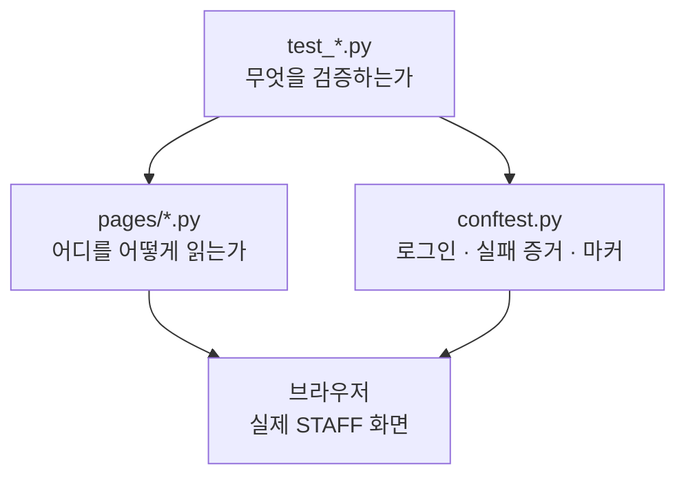
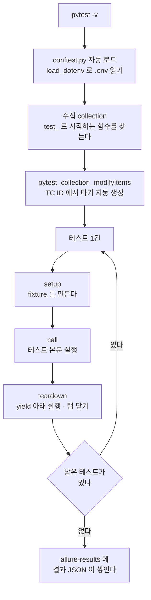
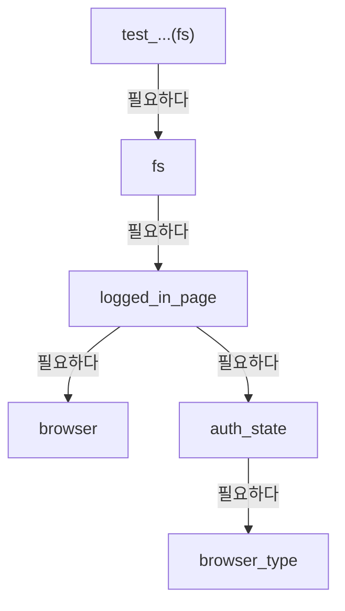
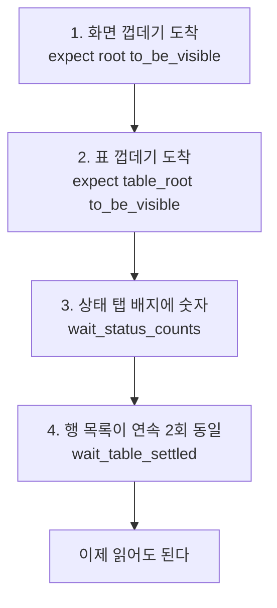
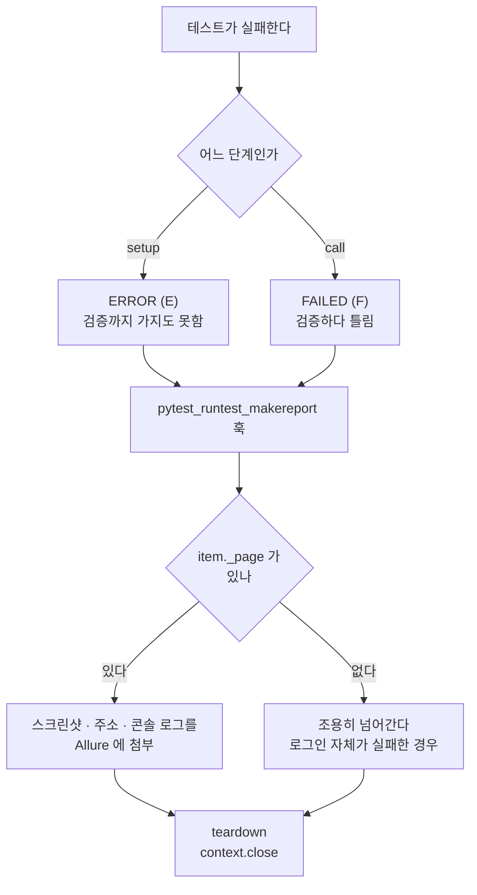
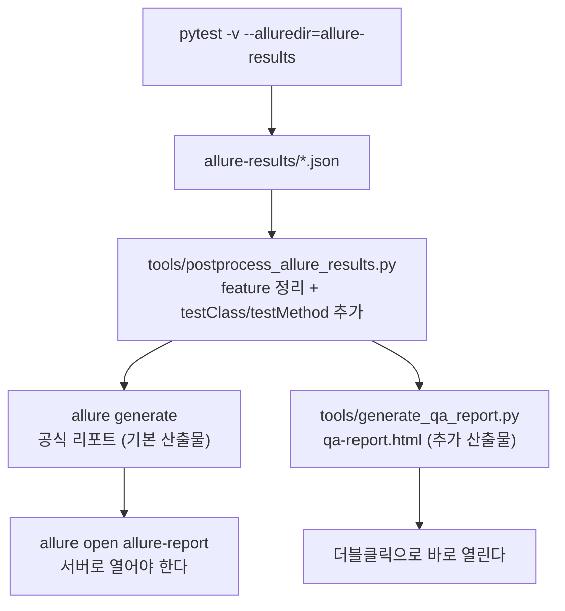
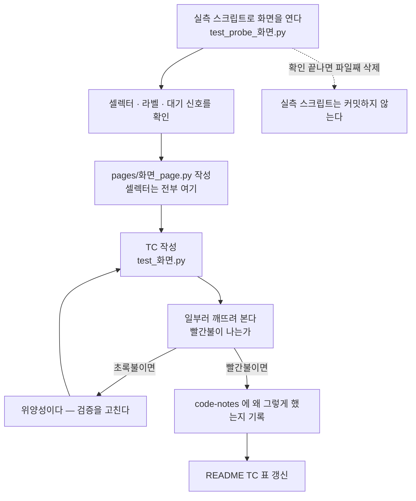

# 자동화 구조와 흐름

이 저장소가 **어떻게 맞물려 도는지**를 그림으로 정리한 문서입니다.
코드를 처음 여는 사람이 "이 줄이 돌기 전에 무슨 일이 있었나" 를 알 수 있게 하는 것이 목적입니다.

기준 시점: **2026-09-09**. 숫자(테스트 건수 등)는 그날 실측한 값입니다.

## 이 문서의 자리 — 옆 문서와 겹치지 않게

| 문서 | 담는 것 |
|---|---|
| **이 문서** | **전체가 어떻게 맞물려 도는가** — 구조와 실행 흐름, 그림 위주 |
| `자동화-테스트-노트.md` | 용어·개념 Q&A — fixture 란 무엇인가, codegen, `assert` vs `expect` |
| `Playwright-pytest-함수-정리.md` | 함수·메서드 사전 — 그 함수가 무슨 일을 하나 |
| `code-notes/<화면>-테스트-노트.md` | 그 화면에서 **왜 그렇게 판단했나** — 실측 근거, 밟은 함정 |
| `code-notes/현장서비스-코드-한줄씩.md` | 그 파일의 **각 줄이 무엇을 하는가** |
| `CLAUDE.md` | 코드를 쓸 때 **지켜야 할 규칙** |

개념 자체의 설명은 여기서 반복하지 않습니다. 여기는 **연결과 순서**만 그리고,
"그게 뭔데?" 는 8장의 색인에서 해당 문서로 넘깁니다.

---

## 1. 저장소 지도 — 파일이 하는 일

```
automation/
├── conftest.py                  로그인 · 실패 증거 첨부 · TC 마커      ← 모든 테스트의 공통 밑바탕
├── test_*.py                    TC 본문 (6개 파일)
├── pages/
│   └── field_service_page.py    현장 서비스 화면의 셀렉터 전부
├── tools/
│   ├── postprocess_allure_results.py   리포트 라벨 정리
│   └── generate_qa_report.py           QA용 단일 HTML 리포트
├── allurerc.mjs                 공식 Allure 리포트 설정
├── run_tests_and_report.bat/.sh 실행부터 리포트까지 한 번에
├── auth.json                    로그인 세션 (★ 커밋 금지 — 토큰 평문)
├── .env                         URL·계정 (★ 커밋 금지)
└── docs/                        이 문서들
```

`main.py` 는 PyCharm 이 프로젝트를 만들 때 넣어준 샘플 스크립트라 자동화와 관계가 없습니다.

## 2. 3층 구조 — 누가 무엇을 아는가



| 층 | 아는 것 | 모르는 것 |
|---|---|---|
| `test_*.py` | 무엇이 정답인지 (`assert`) | testid · DOM 구조 · 대기 방법 |
| `pages/*.py` | 셀렉터 · 대기 · 화면 조작 | 무엇이 정답인지 (`assert` 가 없다) |
| `conftest.py` | 로그인 · 실패 처리 | 화면 내용 · TC 내용 |

경계가 실제로 지켜지는지는 한 줄로 확인됩니다 — `test_field_service.py` 에
`data-testid` 라는 글자가 한 번도 나오지 않습니다.

**단, 이 3층이 완성된 것은 현장 서비스 화면 하나뿐입니다.** `pages/` 에 화면 객체가
하나밖에 없고, 나머지 5개 테스트 파일은 셀렉터를 본문에 직접 들고 있습니다
(모니터 화면은 testid 가 아예 없어 CSS 로 잡습니다). 새 화면을 다룰 때 어느 쪽을
따라야 하는지 헷갈릴 수 있어 적어 둡니다 — **따라야 하는 쪽은 `pages/` 입니다.**

## 3. 실행 흐름 — `pytest` 한 번이 도는 순서



**setup · call · teardown 은 pytest 의 정식 용어**이고 코드에도 글자 그대로 나옵니다
(`conftest.py` 의 `rep.when`).

| 단계 | 무슨 일 | 실패하면 |
|---|---|---|
| **setup** | 준비 — fixture 를 만든다 | `E` (ERROR) |
| **call** | 테스트 함수 본문이 실행된다 | `F` (FAILED) |
| **teardown** | 뒷정리 | `E` (ERROR) |

`E` 와 `F` 를 섞지 않는 것이 중요합니다 — `E` 는 **검증까지 가지도 못한 것**,
`F` 는 **검증하다 틀린 것**입니다. 연속으로 `E` 가 쏟아지면 코드보다
**세션 충돌**을 먼저 의심합니다 (같은 계정으로 pytest 두 개, 또는 브라우저 로그인).

## 4. fixture 사슬 — 요청은 아래로, 생성은 위로

pytest 는 **함수의 매개변수 이름**을 보고 "그 이름의 fixture 를 달라는 뜻" 으로 해석합니다.
등록도 import 도 필요 없습니다.



pytest 는 이 사슬을 끝까지 따라 내려간 뒤 **맨 아래부터 거꾸로 만들어 올라옵니다.**
탭을 열려면 브라우저가 먼저 있어야 하니 순서가 그럴 수밖에 없습니다.

```
생성 순서
 (1) auth_state       auth.json 이 살아 있나 → 아니면 headed 브라우저로 OTP 로그인
 (2) browser          headless 크롬 실행
 (3) logged_in_page   새 탭 + 콘솔 로그 수집기 부착
 (4) fs               메뉴 진입 + 대기 4단
 (5) 테스트 본문 실행
```

**scope 가 왜 다른가** — 비싼 것은 오래 쓰고, 오염되면 안 되는 것은 매번 새로 만듭니다.

| fixture | scope | 몇 번 만들어지나 | 이유 |
|---|---|---|---|
| `browser_type` · `browser` | session | 1번 | 크롬을 띄우는 데 1~2초. 재사용해도 안 더러워진다 |
| `auth_state` | session | 1번 | 로그인은 한 번이면 충분하다 (서버가 단일 세션만 허용) |
| `logged_in_page` | function | 테스트마다 | **탭을 통째로 버려야** 앞 TC 의 화면 상태가 안 남는다 |
| `fs` | function | 테스트마다 | 새 탭이니 화면 진입도 다시 해야 한다 |

**`page` 와 `context` 는 다릅니다.**

```
Browser              크롬 프로그램 하나          ← session. 한 번 띄우고 끝까지 재사용
 └ BrowserContext    독립된 프로필 (시크릿 창)    ← 테스트 실행 1건당 하나
     └ Page          그 창 안의 탭               ← 실제로 조작하는 대상
```

로그인 토큰(`storage_state`)은 **탭이 아니라 창에 붙는 것**이라 context 를 거쳐야 합니다.
`context.close()` 는 그 창과 안의 탭 전부를 닫고, 브라우저와 다른 창에는 영향이 없습니다.
동시에 여러 창이 떠 있는 것이 아니라 **하나 열고 → 쓰고 → 닫고 → 다음 것을 엽니다.**

## 5. 대기 흐름 — 화면 진입이 끝났다고 판정하는 4단

이 순서가 이 프로젝트에서 가장 비싸게 얻은 부분입니다
(`FieldServicePage.wait_loaded()`).



| 단 | 무엇을 막나 | 안 걸면 |
|---|---|---|
| 1 · 2 | 화면 자체가 아직 안 뜬 상태 | 아무것도 못 찾는다 |
| **3** | **데이터가 안 온 화면을 "0건" 으로 오독** | 591건짜리 화면을 0건으로 읽는다 (2026-09-08 실측) |
| **4** | 갱신 중인 목록을 읽음 | 재렌더 중 빈 목록·옛 목록을 읽는다 |

3단과 4단이 역할이 다릅니다. 4단은 **"빈 결과도 정상"** 을 인정해야 해서 빈 화면을
통과시킵니다. 그 구멍을 3단이 앞에서 막습니다 — **한 함수가 다 막는 것이 아니라
둘이 나눠 막는 구조**입니다. 자세한 한 줄씩 해설은 `code-notes/현장서비스-코드-한줄씩.md`
13·14 장에 있습니다.

★ **이 4단은 화면 진입(`wait_loaded`)의 이야기입니다.** 상태 탭을 누르는 자리에는 3단이
없습니다 — 배지는 탭을 눌러도 안 지워져서 "도착 신호" 노릇을 못 하기 때문입니다. 그래서
2026-09-09 에 같은 오독이 탭 클릭에서 재발했고(TC-260907-006 두 건), 지금은 배지를
**"행이 있어야 하는가"** 의 근거로 바꿔 씁니다(`wait_table_settled(allow_empty=...)`).
경위는 `code-notes/현장서비스-테스트-노트.md` 참고.

**핵심 원칙 — 시간이 아니라 상태를 기다립니다.**
`wait_for_timeout(2000)` 은 "2초 안에 될 것" 이라는 도박이라, 빠른 날엔 낭비하고
느린 날엔 깨집니다. 새로 쓰지 않습니다.

## 6. 실패했을 때 — 증거가 남는 경로



**첨부가 teardown 보다 먼저 도는 것이 핵심입니다** — 그래야 탭이 아직 살아 있어
그 시점 화면을 찍을 수 있습니다. TC 본문에서 `assert` 를 `popup.close()` 보다
앞에 두는 것도 같은 이유입니다.

훅이 `setup` 까지 보는 이유 — 진입 단계에서 깨지면 pytest 는 `ERROR` 로 끝내는데,
`call` 만 보면 그때 증거가 하나도 안 남습니다. 2026-09-07 에 현장 서비스 5건이 전부
진입에서 깨졌을 때 리포트에 화면이 한 장도 없어서, 브라우저를 따로 띄워 메뉴 이름을
눈으로 확인해야 했습니다.

**콘솔 로그는 언제 모이나** — 탭을 열자마자 `page.on("console", ...)` ·
`page.on("pageerror", ...)` 로 구독을 걸어 둡니다. 지금 무엇을 실행하는 것이 아니라
"앞으로 이 일이 생기면 이 함수를 불러 달라" 는 등록이고, 그 뒤로 브라우저가 무언가
찍을 때마다 바구니에 한 줄씩 쌓입니다.

## 7. 리포트 파이프라인



```bash
pytest -v --alluredir=allure-results
python tools/postprocess_allure_results.py allure-results
allure generate allure-results --output allure-report
allure open allure-report
python tools/generate_qa_report.py allure-results -o qa-report.html
```

`run_tests_and_report.bat` / `.sh` 가 이 순서를 그대로 돕니다.
커스텀 리포트를 뒤에 둔 이유는 **그것이 실패해도 공식 리포트는 이미 나와 있게** 하기 위함입니다.

**후처리를 `generate` 보다 먼저** 돌려야 합니다 — 후처리는 결과 JSON 을 고치는 것이라,
이미 HTML 로 만들어진 리포트에는 반영되지 않습니다.

| 산출물 | 대상 | 특징 |
|---|---|---|
| `allure-report/index.html` | 기본 — 개발자·상세 진단 | 스크린샷·콘솔 로그·단계별 기록. `allure open` 필요 |
| `qa-report.html` | 추가 — QA 빠른 확인 | 표 한 장. 더블클릭으로 열림 |

`allurerc.mjs` 가 리포트 모양을 정합니다 — 단일 파일(`singleFile`), 트리를 파일명이 아니라
**화면(`feature`) 기준**으로 묶기, 한국어.

### 실제로 쓰는 명령 (PowerShell)

```powershell
# 평소에는 이걸 쓴다. 저장하는 8건은 게이트가 skip 하므로 -m 은 리포트 정리용이다
pytest -m "not mutating" -v --alluredir=allure-results
python tools/postprocess_allure_results.py allure-results
Remove-Item -Recurse -Force allure-report -ErrorAction SilentlyContinue
allure generate allure-results --output allure-report
python tools/generate_qa_report.py allure-results -o qa-report.html
allure open allure-report
```

전부 돌리려면 첫 줄만 `pytest -v --alluredir=allure-results` 로 바꿉니다 —
**dev 차량 4대의 소속 업체가 실제로 바뀌었다 돌아온다는 뜻**이라는 것을 알고 돌립니다.

- **`--alluredir` 를 빼면** 결과 JSON 이 안 쌓여서 리포트를 만들 수 없습니다.
- **후처리를 건너뛰면** 리포트 Labels 가 `로그인 · 권한 · test_login.py` 처럼 한 덩어리로 뜹니다.
- **`allure` 명령이 없다면** `npm i -g allure` 로 한 번 깝니다. 없어도 pytest 와
  `qa-report.html` 은 그대로 나옵니다.
- 한국어 윈도우에서 `-s` 를 붙일 일이 있으면 먼저 `$env:PYTHONIOENCODING = "utf-8"` 을 줍니다.

## 8. 이 흐름에 나오는 단어들 — 개념 색인

| 단어 | 한 줄 | 어디서 나오나 | 더 볼 곳 |
|---|---|---|---|
| **fixture** | 준비 → 건네줌 → 정리를 담은 함수 | `conftest.py` 전부 | `자동화-테스트-노트.md` Q&A 1 |
| **scope** | 그 fixture 를 몇 번 만들 것인가 (`session`/`function`) | 4장 표 | `Playwright-pytest-함수-정리.md` §09 |
| **`conftest.py`** | pytest 가 자동으로 먼저 읽는 공용 준비 파일 | 3장 | `자동화-테스트-노트.md` Q&A 1 |
| **훅 (hook)** | pytest 가 정해진 시점에 불러주는 함수 | 실패 첨부 · 마커 생성 | `Playwright-pytest-함수-정리.md` §15 |
| **setup / call / teardown** | 테스트 한 건의 3단계 | 3장 | 이 문서 · `현장서비스-코드-한줄씩.md` 12장 |
| **`yield`** | fixture 에서 setup 과 teardown 의 경계 | `logged_in_page` | `현장서비스-코드-한줄씩.md` 12-3 |
| **Browser / Context / Page** | 크롬 / 시크릿 창 / 탭 | 4장 | `현장서비스-코드-한줄씩.md` 12-4 |
| **`storage_state`** | 로그인 토큰 꾸러미 (`auth.json`) | `logged_in_page` | `guides/OTP-세션-설계.html` |
| **Locator** | "이 요소" 를 가리키는 주소. 쓸 때마다 다시 찾는다 | `pages/` 의 `@property` | `Playwright-pytest-함수-정리.md` §02 |
| **`expect` vs `assert`** | 재시도 있음 / 없음 | 대기 4단 | `자동화-테스트-노트.md` Q&A 4 |
| **`wait_for_function`** | 브라우저 안에서 조건이 참이 될 때까지 폴링 | 3·4단 대기 | `현장서비스-코드-한줄씩.md` 13·14장 |
| **settled (안정됨)** | 값이 **연속 2회 같을 때**만 "갱신 끝" 으로 본다 | `wait_table_settled` | `현장서비스-코드-한줄씩.md` 14장 |
| **Page Object** | 셀렉터가 사는 유일한 곳 | `pages/` | `CLAUDE.md` · `guides/testid-PageObject-정리.html` |
| **testid** | 테스트용으로 FE 가 붙여 준 식별자 (`data-testid`) | `pages/` | `guides/testid-가이드-프론트전달용.html` |
| **행 식별자 (PK)** | testid 안의 번호로 행을 구분 — 표시 텍스트로 하면 안 된다 | `row_ids()` | `guides/testid-PageObject-정리.html` 6장 |
| **위양성** | 통과하는데 검증은 안 하는 테스트 | TC 설계 전반 | `CLAUDE.md` 위양성 장 |
| **`parametrize`** | 조건만 다른 같은 검증을 하나로 묶기 | TC-006 · 007 | `Playwright-pytest-함수-정리.md` §09 |
| **`@allure.title`** | 리포트에 뜨는 한글 제목. 빠지면 함수명이 대신 찍힌다 | 모든 TC | `Allure-적용-노트.md` |
| **`@allure.label("testcase", ...)`** | TC ID 의 **정본**. 여기서 마커가 자동 생성된다 | 모든 TC | `CLAUDE.md` Allure 장 |
| **`allure.step`** | 리포트에 단계를 남긴다. 동작은 안 바뀐다 | `pages/` 메서드 · TC-007 | `현장서비스-코드-한줄씩.md` 15장 |
| **headless** | 화면 없이 도는 브라우저. 로그인(OTP) 때만 headed | `browser` fixture | `자동화-테스트-노트.md` |

## 9. 새 화면을 자동화할 때의 순서



- **실측 스크립트는 읽기 전용**입니다. 데이터를 바꾸는 버튼은 누르지 않습니다.
- **실행은 사용자가 합니다** — 계정이 단일 세션이라 임의로 돌리면 열어 둔 화면이 끊깁니다.
- **일부러 깨뜨려 보는 단계(E)를 건너뛰지 않습니다.** "이 검증 대상이 망가졌다고 가정하면
  이 테스트가 빨간불이 되나?" 에 답이 "아니오" 면 그 TC 는 없는 것만 못합니다.
- 알아낸 값은 코드 주석과 code-notes 에 **날짜와 함께** 남깁니다.

## 10. 지금 상태 (2026-09-09 실측)

`pytest --collect-only` 기준 **69건**입니다. 함수 수와 다른 것은 `parametrize` 때문입니다.

| 파일 | 실행 건수 | 화면 | Page Object | 데이터 변경 |
|---|---|---|---|---|
| `test_field_service.py` | 15 | 차량관리 > 현장 서비스 | O (`pages/field_service_page.py`) | 읽기 전용 |
| `test_monitor_reseller_filter.py` | 28 | 단말기 > 모니터 | X (testid 가 0개라 CSS) | 읽기 전용 |
| `test_vehicle_company_transfer.py` | 10 | 차량관리 > 차량관리 (업체 변경) | X | **일부 저장함** |
| `test_vehicle_register_reseller.py` | 8 | 차량관리 > 차스펙관리 (등록) | X | 읽기 전용 |
| `test_vehicle_edit_reseller.py` | 6 | 차량관리 > 차량관리 (수정) | X | 읽기 전용 |
| `test_login.py` | 2 | 로그인 · 권한 | X | 읽기 전용 |

**"전부 읽기 전용" 이라고 알고 있으면 틀립니다.**
`test_vehicle_company_transfer.py` 의 TC-059~066 은 [수정] **저장까지 실제로 실행**합니다
(파일 안에 `save_button.click()` 이 있습니다). dev 에 등록해 둔 전용 차량 4대
(`900용1001~1004`)만 쓰고, 저장에 성공한 TC 는 검증 후 원래 업체로 되돌려 반복 실행이
가능하게 해 뒀습니다 — 경위는 `code-notes/차량업체변경-테스트-노트.md` 참고.

그래서 **"이 저장소의 테스트는 안전하다" 를 전제로 아무 파일이나 돌리면 안 됩니다.**
지금 상태의 구멍 두 가지도 함께 적어 둡니다.

**2026-09-09 에 그 8건에 `@pytest.mark.mutating` 을 붙였습니다.** 이제 골라 돌릴 수 있습니다.

```bash
pytest -v                      # 61건 실행 + 저장하는 8건은 게이트가 skip (기본값)
pytest -m "not mutating" -v    # 위와 같되 skip 조차 리포트에 안 남긴다
pytest -m mutating --allow-mutating -v   # 저장하는 8건만 - 플래그가 있어야 돈다
```

**같은 날 옵트인 게이트도 넣었습니다.** `conftest.py` 의 `_mutating_gate`(autouse fixture)가
`mutating` 마커를 보고, 허용이 켜져 있지 않으면 setup 단계에서 스스로 skip 합니다
(켜는 법은 `--allow-mutating` 플래그가 기본 - 그 명령 한 줄에만 삽니다).
허용을 켰더라도 `STAFF_URL` 이 아는 dev 주소가 아니면 `ERROR` 로 끊습니다 -
"운영이면 막는다" 가 아니라 **"아는 곳이 아니면 막는다"** 라서 운영 주소를 몰라도 됩니다. 마커는 "고를 수 있게" 하는 것이고 게이트는 **"기본값을 안 함으로 만드는"**
것이라, 둘은 하는 일이 다릅니다 - `pytest -v` 나 PyCharm 실행 버튼처럼 `-m` 이 안 붙는
경로가 많아서 마커만으로는 못 막았습니다. 실측 `pytest -m mutating -v` -> **8 skipped in
0.87s**(브라우저도 안 뜬다). 경위는 `code-notes/차량업체변경-테스트-노트.md` 참고.

저장에 성공하는 넷뿐 아니라 차단되는 넷에도 붙였습니다 — 차단 케이스도 [수정] 저장을
**누르는 것까지는 같기** 때문입니다.

**여기 "아직 남은 것 둘" 이라고 적어뒀던 것은 둘 다 같은 날 끝냈습니다** (2026-09-09).
기록으로 남기면 이렇습니다.

| 그날 남아 있던 것 | 무엇이 문제였나 | 지금 |
|---|---|---|
| 옵트인 게이트가 없었다 | 마커는 "고를 수 있게" 할 뿐, `pytest -v` 는 8건을 그냥 같이 돌렸다 | `_mutating_gate` 가 skip. `--allow-mutating` 이 있어야 돈다 |
| 원복이 **테스트 본문 마지막 줄**이었다 | 중간에서 실패하면 그 줄에 도달하지 못해 dev 차량이 바뀐 채로 남았다 | `company_guard` fixture 의 **teardown** 이 맡는다 |

여기에 **접속처 화이트리스트**까지 더해 네 겹이 됐습니다 — 마커(고른다) → 옵트인(모르고 도는
것을 막는다) → 화이트리스트(대상이 틀린 것을 막는다) → teardown 원복(치운다).

★ **두 번째 것이 실제로 물었습니다.** 1차 실행에서 원복 전에 예외로 죽어 차량 3대가 어긋난
  채로 남았고, 그 상태에서 이관 TC 들이 **제자리 저장**이 되어 7건이 아무것도 검증하지 않으면서
  통과하고 있었습니다. 자세한 것은 `code-notes/차량업체변경-테스트-노트.md` 의
  "실측으로 뒤집힌 것 두 가지" 를 보세요.

`CLAUDE.md` 에는 "지금 있는 테스트는 전부 읽기 전용이라 아직 위험이 없다" 고 적혀 있었는데,
2026-09-09 에 위 사실을 확인하고 고쳤습니다 — **규칙 문서가 틀리면 그 문서로 하는 판단이
통째로 샙니다** — `데이터를 바꾸는 동작` 장과
`변경성(mutating) 테스트 준비` 장을 함께 보세요.

## 11. 알아 둘 제약

- **pytest 를 동시에 두 개 이상 돌리지 않습니다.** 서버가 계정당 단일 세션만 허용해서,
  두 번째가 로그인하는 순간 첫 번째 세션이 끊깁니다. **같은 계정으로 브라우저에
  로그인해 있어도 똑같이 끊깁니다.**
- 그래서 `pytest-xdist` 병렬 실행도 막혀 있습니다. 워커별 계정을 확보하면 열립니다.
- **한국어 윈도우 콘솔은 cp949** 라, `print` 에 `—`(em dash)나 `✓` 같은 문자를 쓰면
  `UnicodeEncodeError` 로 죽습니다. 회피: `$env:PYTHONIOENCODING = "utf-8"`.
- `auth.json` · `.env` 는 **절대 커밋 금지**입니다 (토큰·계정 평문).
